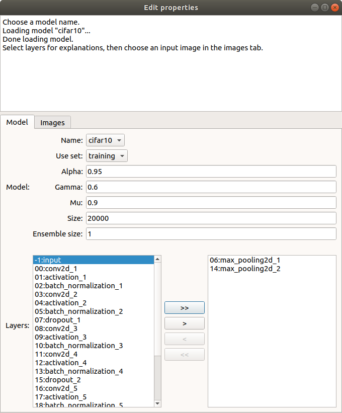
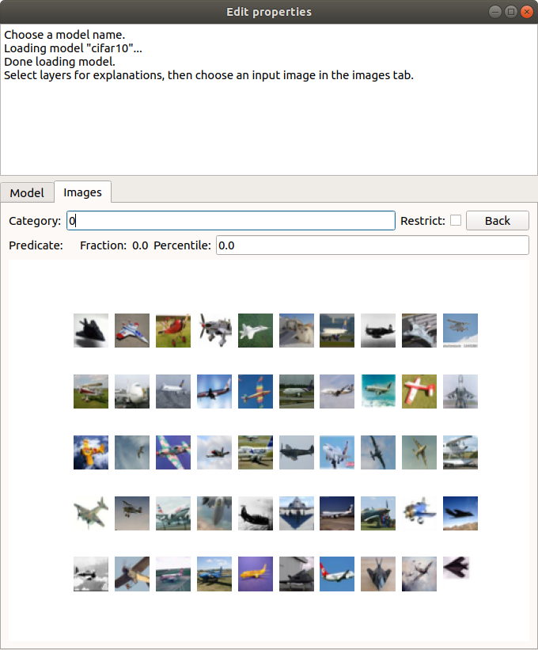
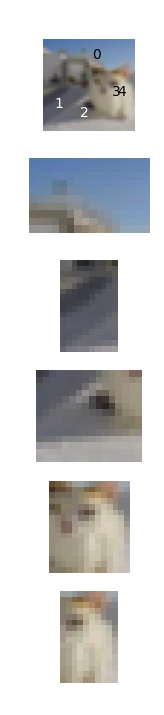
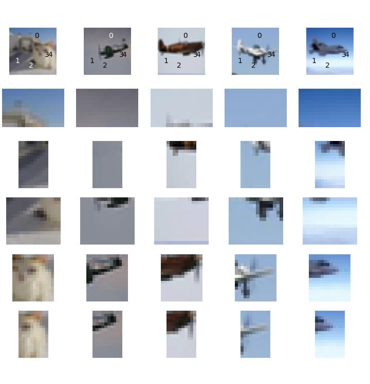
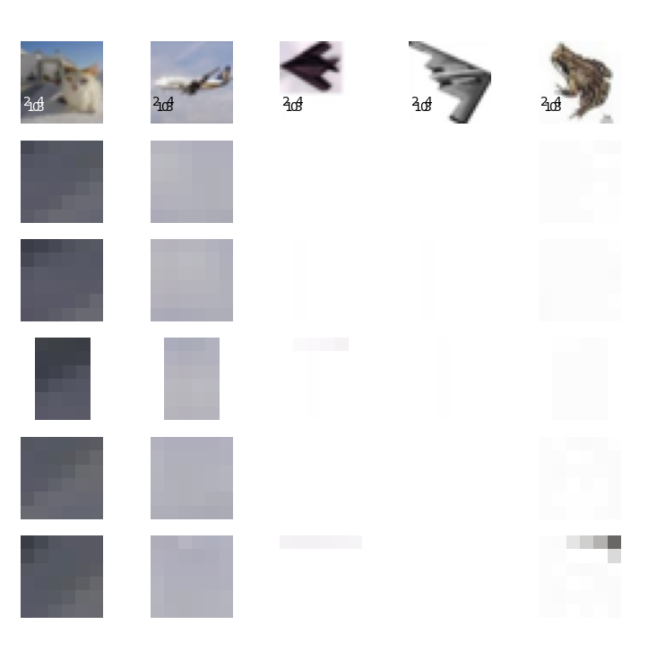
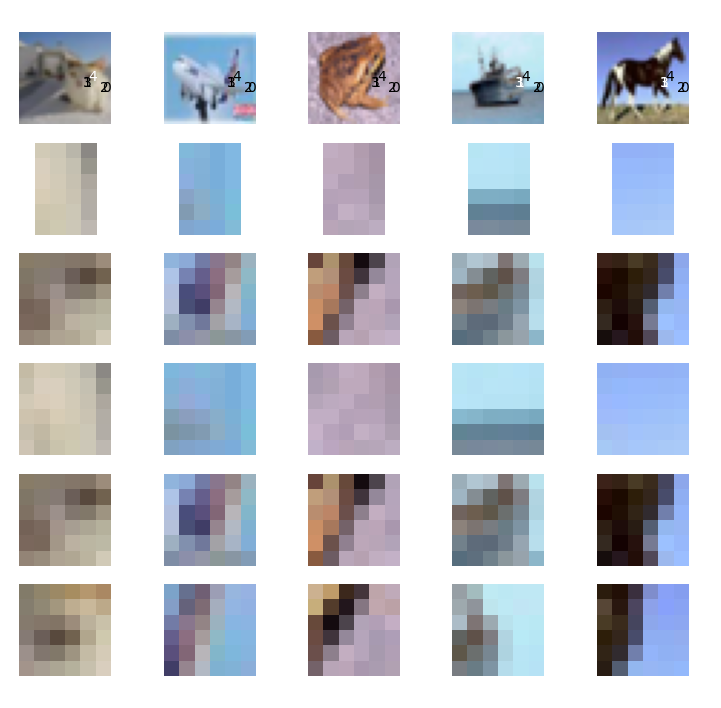
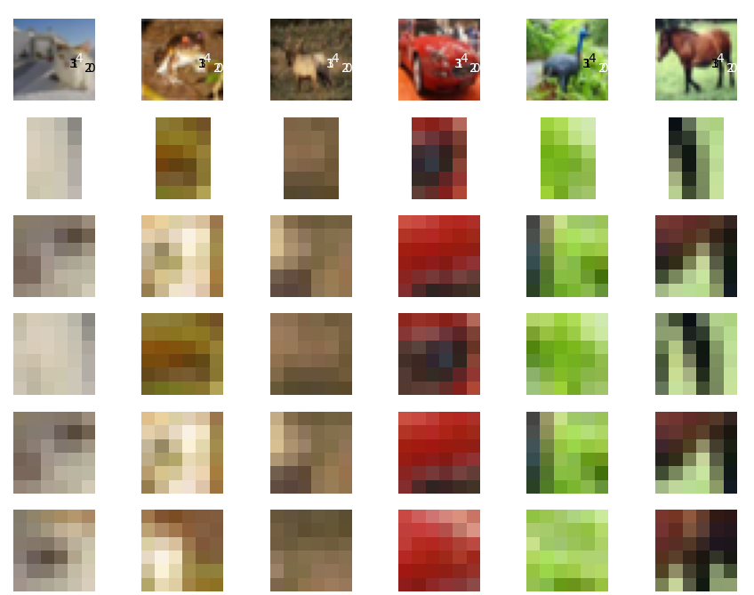

Quick start
===========

Start nnitp by entering this command::

  nnitp

From the drop-down box labeled `Name`, choose `cifar10`.
This is a model with 6 convolutional layers that classifies images in
the CIFAR-10_ dataset.

.. _CIFAR-10: https://www.cs.toronto.edu/~kriz/cifar.html

After the model loads, you will see a display like this:

At the bottom left of the window, you see a list of layers of the
model that are available for explanations. Pooling layers 6 and 14,
shown on the right, have been pre-selected. You can move layers into or
out of this list by selecting them and using the `<` and `>` buttons.

Click the `Images` tab. This will show you a collection of the first
50 training images in the dataset that the model classifies as airplanes (classification
`0`):

Notice that the sixth image in the first row is actually an image of a
cat that the network has mis-classified. Let's try to understand what
features of this image caused it to be mis-classified. Click on the
image to select it. You will see a larger version of the image. Click
on this larger version to compute an explanation.

Computing the explanation will take about 20 seconds on an ordinary CPU, because
`nnitp` first has to evaluate the model over a large collection of
images. When the computation is finished, you will see a message like this::

    Interpolant: layer 14: (v(0,4,25)<=-0.69624305 & v(5,0,44)>=1.063251 & v(6,3,62)>=0.53659225 & v(4,6,34)>=3.1080968 & v(4,7,8)>=-0.6518301)
    On training set: F = 1, N = 67, P = 1954, precision=0.9850746268656716, recall=0.033776867963152504
    On test set: F = 5, N = 39, P = 980, precision=0.8717948717948718, recall=0.03469387755102041

Nnitp has computed an `interpolant` at layer 14. This is a fact about
the activation of the layer for this image that predicts a
calssification of `airplane` with fairly high precision. That is,
given interpolant condition, the probability of a test set image
being classified as an airplane is 0.985, while the probability over
test set images is 0.872. Because the interpolant was learned over the
training set, it's the test set precision that counts. The `recall` of
the interpolant is about 3.5%. This means that about 3.5% of the
images classified as airplanes satisfied this condition.

The interpolant is a logical `and` of five constraints on unit
activations. For example, the constraint `v(0,4,25)<=-0.696` tells us
that the activation of channel 25 at image coordinate position `(0,4)`
is less than or equal to `-0.696`. This fact is not very helpful to
begin with, since we don't know what features of the image these units
represent. To give a better idea, `nnitp` displays a grid of
images. In the column on the left, we see our cat image, and, below
it, the five regions of the image that affected the five neural net
units in the interpolant. Superimposed on the top image are digits
0--4 placed at the location of the corresponding unit:

The remaining columns of the image grid are comparison images. These
are images that also happen to satisfy the interpolant condition. In
each row, we see the image region that affects the corresponding
constraint:

We can already begin to see why the network thinks the cat is an
airplane.  Regions 0--2 correspond to mostly empty space in all of the
images. On the other hand, regions 3--4 contain a diagonal feature in
the true airplane images.

To understand why the cat also has these features, let's look for
explanations of some of the individual constraints. As an example, the
image in the left column, third row, satisfies constraint 1. It is a
gray region with some diagonal streaks. Click on that image to get an
explanation of why it satisfies condition 1. This time, we got very
good precision of the interpolant: it is a fact about layer 6 that
predicts the feature at layer 14 with 97.6% probability over the test
set.

Here is part of the resulting image grid:

The regions used in the constraints five constraints have fewer pixels
because layer 6 is closer to the input image. By comparing to the
columns at right, we see that this feature is just recognizing blank
space. Notice that one of the comparison images satisfying this
interpolant is actually a frog surrounded by blank space.

Now click the back button, to go back to our origin interpolant at
layer 14.  Click on the image in the left column, fifth row, that
shows the cat's face. Again, we get an interpolant with pretty high
precision: 98%. Here is part of the grid:

What's in common to these images, including a frog, a ship and a
horse, is that they contain diagonal feature, with some blank space
around it.  In the case of the cat, the diagonal feature runs between
the nose and the left eye of the cat. In effect, the net has confused
the face of the cat with the tail or wing of a plane.

It's clear that the network is not recognizing shapes in the sense
that we normally think of them, as connected objects. The network has
learned that a single diagonal feature with a lot of blank space
around it is sufficient to distinguish an airplane, and this has
resulted in incorrectly classifying an image of a cat that happens to
have these features as an airplane. Perhaps this means that we should
add images of airplanes over more varied backgrounds to the training
set.

It's also interesting to note that the individual units within the
network are nearly uninterpretable as features. To get a sens of this,
left-click on the image of that cat's face in the left column, row
three, and select the menu item `Examples`. This will show some images
that satisfy the interpolants constraint on just one unit. Here's some
of what we see:

Some images regions in the third row do indeed contain a diagonal
edge, but its very hard to generalize about these image fragments.
This seems to be generally true about neural nets: an individual
hidden unit is a very noisy predictor. We need to collect an ensemble
of units to recognize a meaningful feature.

